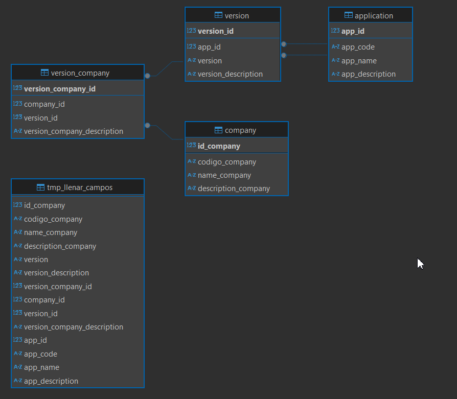

# 📦 Company Service

Proyecto backend construido con **Spring Boot**, que gestiona compañías, versiones y aplicaciones relacionadas. Incluye relaciones entre tablas y soporte para carga masiva desde una tabla temporal (`tmp_llenar_campos`) mediante procedimientos almacenados en MySQL.

---

## ⚙️ Tecnologías utilizadas

- ✅ Java 21
- ✅ Spring Boot 3
- ✅ Spring Data JPA
- ✅ MySQL
- ✅ MapStruct
- ✅ Lombok

---

## 🧠 Arquitectura de Datos

Este proyecto gestiona las siguientes entidades relacionadas:

- `company`
- `application`
- `version`
- `version_company`

Se utiliza una tabla temporal (`tmp_llenar_campos`) para realizar inserciones en cascada a través de un procedimiento almacenado.

### 🗂 Diagrama de relaciones:

